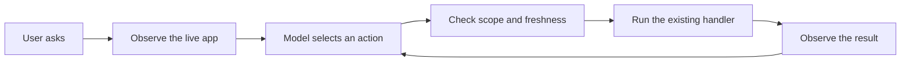

<p align="center">
  
</p>

<p align="center">
  <a href="https://waymode.ai">Website</a> ·
  <a href="#install-with-your-agent">Install</a> ·
  <a href="https://github.com/mossburgh/waymode/blob/main/docs/EVALS.md">Evidence</a> ·
  <a href="https://github.com/mossburgh/waymode/blob/main/docs/PRIMITIVES.md">Primitives</a> ·
  <a href="./LICENSE">MIT</a>
</p>

Waymode lets an app use its existing actions and live views with a pluggable
decision model. A new control enters the next live snapshot, so the
app can use it without a matching model tool. The host keeps its own handlers,
permissions, validation, and state.

> **Current scope:** same-document web apps and React DOM hosts. Next.js,
> TanStack Start, React Native, and native adapters are planned.

## Install with your agent

From your application, install the agent skill:

```sh
npx skills add mossburgh/waymode --skill waymode
```

This uses Vercel's [skills CLI](https://github.com/vercel-labs/skills) to install
[Waymode's integration guide](https://github.com/mossburgh/waymode/blob/main/skills/waymode/SKILL.md) in your coding agent.
It does not install the runtime or change your app. Then ask your agent:

```text
Install Waymode in this repository. Use https://github.com/mossburgh/waymode as the source of truth. Read its README, primitives, architecture, and evidence before changing code. Detect the app's client and server boundaries. Connect Waymode to the app's existing actions, permissions, and interface. When a safe action is not exposed, add the smallest reusable primitive that makes it available without copying business logic. Keep model keys on the server. Run Waymode's setup checks and self-driving evals, keep working until they pass, then report what users can ask the app to do and the evidence for each claim.
```

Your existing auth, confirmation, and policy checks still decide what each user
may do. The guide connects the SDK to those boundaries and checks the result.

### Install the SDK

The first npm publication is pending. Once available, the runtime install is:

```sh
npm install @mossburgh/waymode
```

The package provides browser, server, React, and core exports. It is a library,
so there is no `npx waymode` executable. Use the source path below while npm
publication is pending.

### Install from source

Use Node.js 22.22.1+ on Node 22, or Node.js 24+.

```sh
git clone https://github.com/mossburgh/waymode.git
cd waymode
npm ci
npm run verify
npm pack

# Run this from your application:
npm install /absolute/path/to/waymode/mossburgh-waymode-0.2.0.tgz
```

This is the manual path until `@mossburgh/waymode` is published to npm.

## How it works



Waymode has one control loop and a small set of host-owned surfaces:

1. **Observe.** Read the controls or typed operations the current user can reach.
2. **Decide.** Ask the model to select an action, finish, or abstain.
3. **Guard.** Check the action handle, scope, confidence, and freshness.
4. **Act.** Invoke the app's existing handler or typed operation.
5. **Verify.** Observe the new view; use the app's server state to prove durable effects.

Waymode can act directly, bring a live interface into chat, or guide a user with
a cursor. Those are views over the same app behavior. See
[the primitive contract](https://github.com/mossburgh/waymode/blob/main/docs/PRIMITIVES.md) and
[the platform boundary](https://github.com/mossburgh/waymode/blob/main/docs/SURFACES.md).

## Reproduce the contracts

```sh
npm run verify
npm run package:check
```

Tests live beside their modules. Demo apps, recordings, and launch assets are
maintained outside this SDK repository. Live app claims require a retained run
against the packed SDK; the unit suite does not establish model accuracy.
See [the eval contract](https://github.com/mossburgh/waymode/blob/main/docs/EVALS.md).

## Connect a web app

Give the browser an explicit app root and a same-origin decision endpoint:

```ts
import { createHttpDecider, createWaymode } from "@mossburgh/waymode";

const app = document.getElementById("account-app");
if (!app) {
  throw new Error("Account app is not mounted.");
}

const agent = createWaymode({
  root: () => app,
  decide: createHttpDecider("/api/waymode/decisions"),
});

const controller = new AbortController();
const result = await agent.run("Open settings", {
  maxSteps: 8,
  signal: controller.signal,
  onDecision: (receipt) => console.info(receipt),
});
```

Keep chat, source views, billing, and unrelated controls outside the root. Add
`data-waymode-ignore` to any control or subtree that Waymode must not observe.
Use native controls and clear accessible names; Waymode reads the app's existing
semantics.

Wire the adapter into an authenticated server endpoint:

```ts
import { createEvaluator, createDecider } from "@mossburgh/waymode/server";
import { requireAuthorizedAppRequest } from "./auth.js";

const evaluate = createEvaluator({ model: "provider/evaluation-model" });
const decide = createDecider({ evaluate });

export const POST = async (request: Request): Promise<Response> => {
  await requireAuthorizedAppRequest(request);
  const decision = await decide(await request.json(), request.signal);
  return Response.json(decision);
};
```

Replace `provider/evaluation-model` with an evaluation-capable model ID from your gateway.

`requireAuthorizedAppRequest` belongs to the host. It must enforce the app's
session, origin, and CSRF rules. Apply request and rate limits to this endpoint.
Waymode validates the decision and live action handle; it does not grant access.
Keep authorization, confirmation, input checks, and idempotency in the handlers
that already protect each operation.

The optional `beforeAction(control, signal, element)` hook can wait for a
host-owned confirmation. The optional `settle(signal)` hook can wait for the
host's real pending effects; without it, the runtime waits 250 ms between
actions. Use the app's saved state to prove a write completed.

For text input, send the exact value apart from the goal. The model selects the field;
it does not generate the text:

```ts
await agent.run("Fill the display name field", {
  value: "Robin",
  maxSteps: 1,
});
```

The fill value stays in the browser. Existing field values do not enter control
snapshots. Goals, labels, and descriptions do go to the model, so keep secrets out of
those fields.

## Connect typed server actions

`createCommandGuard(schema, options)` accepts the app's existing Zod command
contract. It checks a proposed command against the original request and returns
a parsed match or an abstention. It does not execute or authorize the command.

```ts
import { createEvaluator, createCommandGuard } from "@mossburgh/waymode/server";
import { commandSchema, executeCommand } from "./app-commands.js";

const evaluate = createEvaluator({ model: "provider/evaluation-model" });
const guard = createCommandGuard(commandSchema, { evaluate });
const judgment = await guard(
  { request: originalUserRequest, command: proposal },
  signal,
);

if (judgment.outcome === "matched") {
  signal.throwIfAborted();
  await executeCommand(judgment.command);
}
```

The host supplies the authenticated request, schema, and executor. New fields in
that schema need no separate agent tool. Arbitrary functions, missing schemas,
and hidden permissions are not discovered by the guard.

When a tool transport turns optional object fields into required fields,
`createPatchSchema` derives a nonempty list of `{ key, value }` changes from an
existing Zod object. It returns the normal sparse patch, rejects duplicate keys,
and keeps each field's validator.

## Bring live views into chat

For app-owned vanilla DOM, `embedView(view, outlet)` moves the existing element
into a chat outlet and returns a restore function. It does not clone the view or
render a screenshot. Bind that move to an ordinary named control so Waymode can
select it.

For React, `useLiveView(children)` from `@mossburgh/waymode/react` returns
`content`, `outletRef`, and `root`. Render `content` once and attach `outletRef`
to one empty outlet at a time. The live view keeps its React context and state as
it moves. React 19 is an optional peer dependency.

`createCursorGuide(cursorElement)` returns a `beforeAction` hook. The cursor shows
the target, respects reduced motion and cancellation, and never clicks. It is a
guide, not evidence that an action or save completed.

## Decision and gateway contract

Each server helper owns its operation deadline through `timeoutMs` (15 seconds
by default). The evaluator forwards that signal; it adds no second deadline.

The browser accepts a `Decide` function. Server helpers accept an `Evaluator`
function through `{ evaluate }`: `createDecider`, `createInputResolver`,
`createCommandGuard`, and `createReviewer` share this boundary. The evaluator
receives `{ state, questions, signal }` and returns typed choice answers. Keep
credentials and transport code on the server.

`createEvaluator({ model, apiKey?, pricing? })` supplies the Vercel AI
Gateway transport. The model is required; the SDK has no default model or price.
With no explicit key, the AI SDK uses its server-side Gateway environment
configuration. A custom transport can be supplied through this factory's
`evaluate` option. Hosts using another gateway can instead supply their own
`Evaluator` directly. That function must return `response.modelId`, known choice
keys and probability distributions, and honor cancellation. Other providers must
pass the same outcome evals before claiming equivalent behavior.

Each model call records elapsed time, model identity, tokens when supplied, and
cost. Provider cost takes precedence. Optional `pricing` supplies
`inputUsdPerMillion` and `outputUsdPerMillion` for an estimate when the returned
model matches the configured model. Missing rates or required usage leave cost
unknown. Hosts must supply current rates for their chosen model when estimating cost.
No-call abstentions report model `unavailable`.

Source consumers migrating from the earlier preview must replace the
provider-specific factory names with the neutral names above, create an evaluator explicitly,
and pass `{ evaluate }` to each server helper. Reuse one evaluator across helpers.
Historical evals still identify the model and API used for that run.

## Safety and limits

1. Every step discovers current controls and creates short-lived handles. The browser checks the handle again before invoking the original element.
2. The model must select a known control with at least 0.7 probability by default. A missing, unclear, or low-confidence choice stops the run.
3. Runs allow eight actions by default, with a configurable limit of 1–16. `completed` is the model's reading of the observed view; verify durable effects through the app's server state.
4. The first release covers visible buttons, links, click controls, plain text inputs, and native single-select controls. It excludes private inputs, file uploads, cross-origin frames, closed shadow roots, custom gestures, and native apps.
5. Browser and React DOM hosts have evidence. Next.js, TanStack Start, React Native, framework server actions, and native adapters are not implemented or proved by these tests.

Read [the platform boundaries](https://github.com/mossburgh/waymode/blob/main/docs/SURFACES.md) and
[the evidence requirements](https://github.com/mossburgh/waymode/blob/main/docs/EVALS.md) before making a broader claim.

## Evidence

Deterministic tests cover the SDK contracts. Live model accuracy needs a separate
run against the exact source and provider configuration. Historical development
reports are archived outside the source tree; this checkout makes no aggregate
live success-rate claim from them. See [how to reproduce and grade a run](https://github.com/mossburgh/waymode/blob/main/docs/EVALS.md).

The loop lives in `@mossburgh/waymode/core`. The browser entry point uses it
through `createBrowserSurface`; each platform supplies observation, invocation,
and freshness checks. See [the architecture](https://github.com/mossburgh/waymode/blob/main/docs/ARCHITECTURE.md),
[surface contract](https://github.com/mossburgh/waymode/blob/main/docs/SURFACES.md), and
[eval requirements](https://github.com/mossburgh/waymode/blob/main/docs/EVALS.md).

## Develop

```sh
npm run verify
```

This runs lint, type checks, behavioral tests, the package build, and formatting
checks. Tests run without a model key. Live provider behavior, browser consent,
and edited features need separate integration evidence.

Live control evals use public fixtures and a server-held Gateway key. Set
`WAYMODE_MODEL` in `.env.local` to the evaluation model to test:

```sh
WAYMODE_TEST_LIVE=1 node --env-file=.env.local node_modules/vitest/vitest.mjs run src/server/index.live.test.ts
```

Read [CONTRIBUTING.md](https://github.com/mossburgh/waymode/blob/main/CONTRIBUTING.md) before opening a change.

## License

[MIT](./LICENSE), copyright 2026 Mossburgh.

The server adapter uses the
[AI Gateway evaluation API](https://vercel.com/docs/ai-gateway/modalities/evaluation).
