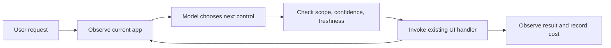
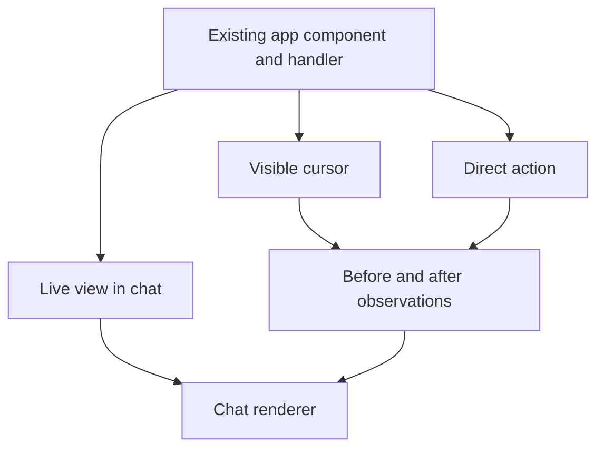
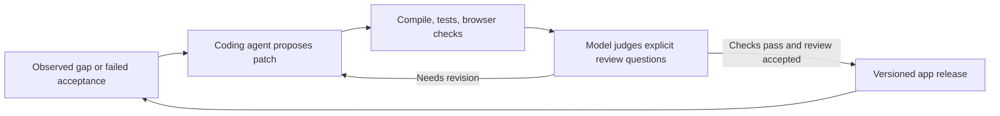

# One feature implementation, several ways to use it

waymode discovers the application's interface at runtime. Developers keep their
normal UI and its handlers. They do not maintain a second tool catalog for every
feature. Application scope is the permitted app and session, not a list of
registered features.

The package has a pluggable evaluator, billing receipts, a typed command guard
and a tested React live-view hook. Host apps and their saved-state evals live
outside this repository. Automatic framework binding, native clients and broad
browser fallback are not implemented. See
[the platform boundaries](./SURFACES.md) and [eval requirements](./EVALS.md).

## The runtime

| Code                     | Responsibility                                          | What it must not own                     |
| ------------------------ | ------------------------------------------------------- | ---------------------------------------- |
| `src/browser/inspect.ts` | Discover accessible controls; issue short-lived handles | Feature names or business rules          |
| `src/server/index.ts`    | Ask the model for a bounded choice or abstention        | Credentials in the browser, side effects |
| `src/browser/execute.ts` | Activate the same control a person uses                 | A second implementation of the feature   |
| `src/browser/run.ts`     | Bound steps; cancel; report observations                | Claim a server save from a click         |
| `src/server/receipt.ts`  | Validate provider usage and billing                     | Invent missing costs                     |

Discovery defaults to the document, with the waymode UI marked as excluded.
A host may narrow the root or exclude a subtree. Private fields stay out of model
snapshots; ordinary field values and the separate supplied fill value stay in
the browser. The request sends only whether the action is click or fill.
Freeform goals and control labels still go to the model.

If a feature is behind a menu, the agent navigates and observes again. If labels
are missing or an interface uses canvas, this adapter may abstain. A browser
adapter can later add screenshots and trusted pointer/keyboard interaction.
That is another implementation of observation/action, not one tool per feature.
No fallback is currently installed. An absent feature remains absent.

## Presentation should reuse the live app

The browser runtime can activate an existing control without a cursor. For an
unmounted feature, the host can instead send a proposal through the typed command
guard and its existing executor. The host must retain authorization, consent and client state
updates. A before/after control observation is evidence of local state; durable
effects need the application's existing server acknowledgement.

The current vanilla helper moves the same DOM node. For React, keep one stable
portal container and move that container between outlets. Mounting a second
component or changing the portal target can lose draft state. The app owns its
component lifecycle and authentication context.

Vercel's json-render is optional display infrastructure. Its catalog can contain
two generic entries: AppView with a trusted view ID, and ActionReceipt with a
trusted receipt ID. It does not need a passkey or theme-specific model action.
A host view catalog can come from its existing route/panel catalog. This is an
adapter requirement for live embedding, not a requirement for DOM control.

For two known message types, the host's existing React renderer may be smaller
than another dependency. Use json-render when composing new layouts from a
bounded catalog becomes a demonstrated need. Never make it the execution engine.

## Improvement is a separate development loop

The evaluation API used here returns choices, scores, and probabilities. The model can
select a component, classify a gap, or assess a proposed revision. It does not
emit JSX through this API. A code-generating model writes missing code using the
application's build primitives. Its output goes through a normal isolated build
and release path; runtime JSON cannot introduce executable code.

The review primitive compares supplied before/after code and check results. It
can flag suspected duplication or added complexity. It is advisory: confidence
does not prove behavior preservation or simplicity. A recursive loop needs a
fixed budget, a stop condition, and external tests that the candidate cannot
rewrite merely to pass.

## Scaling means bounded work

The useful target is constant integration work as features grow. One generic
observer and executor can discover new controls without new tools. Each decision
still sees a bounded screen or query, with bounded steps and cost. More screens,
custom gestures, and frameworks bring real adapter and verification work.
There is no infinite scaling guarantee.

The host remains the authority for access and writes. A model cannot infer or
grant a missing permission. Live DOM and generated code are untrusted inputs.

## Evidence

Keep behavioral tests beside their modules and run live host checks separately.
See [the eval contract](EVALS.md) for independent saved-state oracles, failure
retention, and the limits of model completion judgments.

## Sources

- [Gateway evaluation API](https://vercel.com/docs/ai-gateway/modalities/evaluation)
- [json-render catalog](https://json-render.dev/docs/catalog)
- [json-render registry](https://json-render.dev/docs/registry)
- [React portal contract](https://react.dev/reference/react-dom/createPortal)
