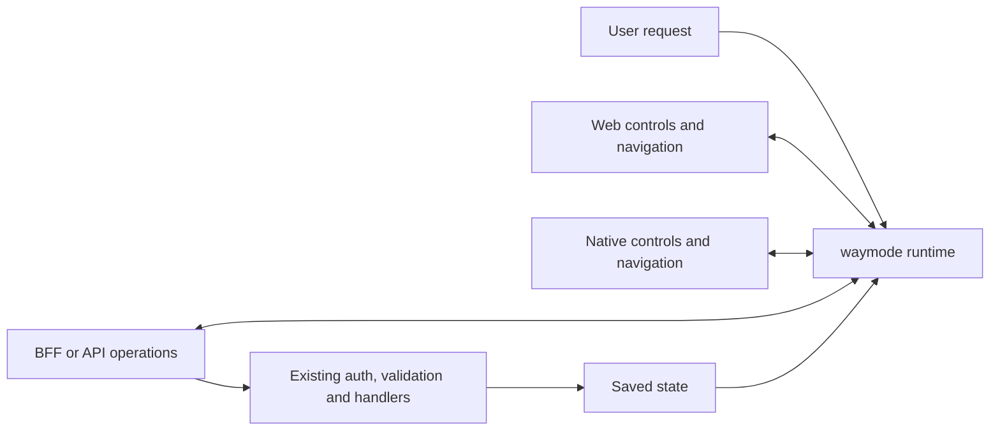

# One runtime across app boundaries

`createWaymode` in `@mossburgh/waymode/core` owns the loop. It imports no DOM,
React, Node, network client, or framework. Platform adapters supply an `AppSurface`:
observe available actions and public state, invoke an existing handler, check that
an observation is still current, and retire its handles. The browser entry point
wraps this same runtime with the DOM adapter.



This diagram is the architecture, not a support claim. The DOM adapter is tested.
The bounded OpenAPI adapter has contract tests; live host outcomes need separate proof. Native controls,
Next server actions and TanStack server functions still need adapters and live proof.

## A feature has one definition

This is the target contract. Automatic discovery of arbitrary action schemas
remains unsupported; adapters consume a contract supplied by the host.
The normal app owns its operation's input contract, label, handler and authorization.
An adapter derives agent choices from that existing definition. waymode owns no
second feature registry. Adding or changing a definition changes the next observation;
removing it invalidates old handles. A generated manifest is a build artifact, not a
second set of handwritten tools.

OpenAPI is one input format for an adapter. It is not the public abstraction and it
is not required of every app. A framework adapter can read its existing typed router
instead. The [OpenAPI specification](https://spec.openapis.org/oas/v3.1.1.html)
provides a language-independent description of HTTP operations. A Rust or Python
service can therefore share the same HTTP adapter; this repository has not yet run
integration tests against either language.

| App shape                | Adapter boundary                                                 | Proof still needed                         |
| ------------------------ | ---------------------------------------------------------------- | ------------------------------------------ |
| React web                | Live DOM plus local handlers                                     | Additional custom controls                 |
| Next or TanStack Start   | Web UI plus the framework's normal server interface              | Server-action/server-function discovery    |
| React plus Rust API      | Web UI plus the existing HTTP contract                           | Live Rust service                          |
| Next BFF plus Python API | Web UI plus BFF operations; BFF calls Python normally            | Live BFF and Python service                |
| React Native             | Native views/navigation plus its authenticated backend interface | Native adapter and iOS/Android device runs |

A BFF continues to own orchestration and user permissions. waymode should call the
boundary used by that client; it must not route around the BFF to a privileged
internal service. A mobile client may expose different actions from the web client
because its permissions, state and device capabilities differ.

React Native provides [accessibility labels, roles and state](https://reactnative.dev/docs/accessibility).
Those can describe native actions; they are not by themselves an invocation or
portal implementation. The native adapter must bind the app's existing handlers,
router and view lifecycle. A desktop browser at mobile width is not a native test.

## Current code shape

```ts
import { createWaymode } from "@mossburgh/waymode/core";

const agent = createWaymode({
  surface: adapter,
  decide,
  settle: waitForAppEffects,
});
await agent.run("Enable compact layout");
```

`adapter`, `decide` and `waitForAppEffects` are host integration points. The browser
entry point supplies `createBrowserSurface`; server code can use the experimental
OpenAPI adapter. Both use the same runtime. `combineSurfaces` joins connected surfaces.
`createSurfaceSession` and the browser `createHttpSurface` carry operations across
a host-owned HTTP endpoint. The host must authenticate that endpoint and bind each
surface to the current user; composition does not supply authorization.

A skill can install that integration once, and a build check can report features
that have no discoverable interface. Those installer/build checks are planned.
Neither the runtime nor a lint rule can infer the permissions or intent of arbitrary
private functions. Apps without a usable UI or action contract need a one-time
integration at their normal action boundary.

## First backend adapter: bounded support

`createOpenApiSurface` reads the current OpenAPI 3.1 document for each observation.
It supports JSON-body operations with finite boolean/enum/const inputs, nested
objects, operations with no body, and explicit host/user-supplied inputs validated
against the API schema. It preserves schema field descriptions in model choices.

It reports gaps for path/query/header parameters, unsupported schemas, unbounded
inputs without a supplied value, more than 64 candidate calls, and oversized
choice descriptions. Free-text generation, large catalogs, resource selection,
streaming and file uploads are not proven. This is not arbitrary backend coverage.

Bind `document`, `readState`, `authorize` and `dispatch` once to the authenticated
app session. `authorize` filters discovery and runs again before dispatch. It must
handle a catalog check with no input as well as concrete inputs. `dispatch` invokes
the normal router; that router must revalidate authorization, resource ownership,
input and any version condition at the actual write. Snapshot checks cannot replace
a database transaction or optimistic concurrency check.

Only expose model-safe operations, argument values and state. Explicit backend
inputs are included in the decision context; do not supply secrets. The adapter does
not infer data classification from arbitrary schemas. Model confidence grants no
permission. A `confirm` policy returns `confirmation-required` without invocation;
the app's existing consent flow must obtain permission.

Handles expire after 30 seconds and are consumed before dispatch. Schema or state
changes invalidate pending actions. There is no automatic retry after an uncertain
write. Invocation receipts mean the handler returned, not that the user's entire
goal succeeded. The next observation reads fresh state, and evals query the saved
record independently.

## Outcome judgment is part of the loop

The model selects an action and judges whether fresh observations satisfy the complete
user request. The app supplies facts: saved API state, rendered controls, view
location, and errors. A successful response or an invoked handler alone is not
completion. A combined request needs evidence for every part, such as the saved
dark preference plus settings actually mounted in chat.

The current runtime asks for `done` or another action on the next observation.
It rechecks freshness before accepting completion. This is a probabilistic semantic
judgment, not an authorization decision or an independent correctness oracle.
Evals compare it with exact saved-state and rendered-state assertions. False
completion, partial completion and safe abstention need separate grades.

## Current evidence

Use [the eval contract](EVALS.md) to check each connected adapter.
No current aggregate live score is asserted here.

## Release gate

Freeze the SDK and integration. Add, rename, change inputs on, and remove an action
in ordinary app code. Run the same requests from web and native clients. Verify
exact saved state, unchanged unrelated fields, navigation, permissions, stale
handles, cancellation and confirmation. Retain failures, timing, costs and source
hashes. Record the public video only after those intended claims have live evidence.

## External agents and computer use

`createRemoteSurface` adapts the same session protocol for an external process or
another host-owned transport. It has no browser or model dependency. Supply an
authenticated transport and preserve the host's error types and cancellation:

```ts
import { createRemoteSurface } from "@mossburgh/waymode/core";

const surface = createRemoteSurface((operation, data, signal) =>
  sessionClient.request({ operation, data }, { signal }),
);
```

The host must bind `createSurfaceSession` to the current authenticated owner.
Discovery grants no permission. The server checks the snapshot, binds supported
inputs, and invokes its existing handler. Retired or changed handles cannot be
reused. Backend input binding remains the host's responsibility; this transport
does not accept unvalidated caller arguments.

The browser's `createHttpSurface` uses this same adapter. MCP, WebMCP, and desktop
screenshot/pointer controllers are not included. An external agent can also use
its own browser controller for the normal UI.

An external transport must preserve cancellation, expiring handles, confirmations,
and the current user's permissions. A denied operation must stay denied; switching
to computer use is not permission to route around it.
